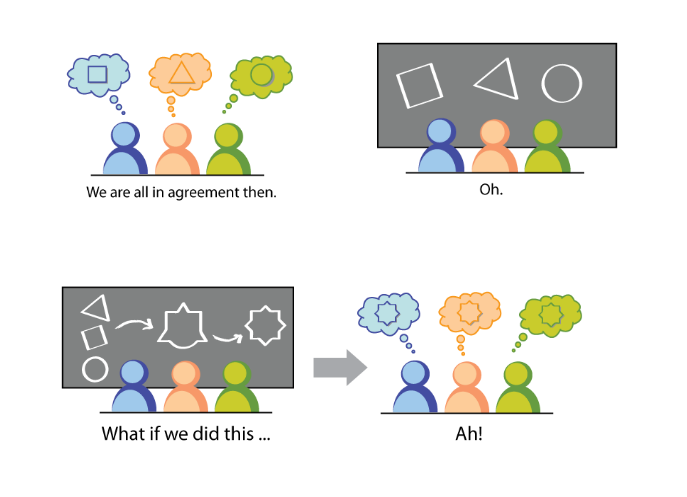
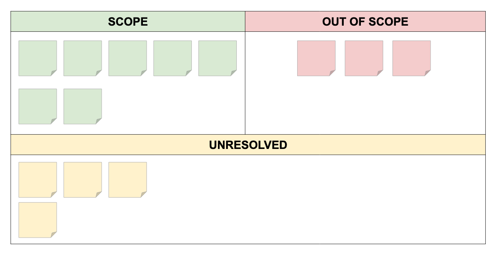

Do you remember the kick-off day of the initiative you're currently working on?
What about the first meetings where everyone was on an agreement on what to do, and what's next?
That general positive spreading throughout the room, that lovely shiny feeling
of a new thing to develop. How awesome was that, right?

Now, take a step back and look where you are today.
Do you feel the same way?

Yes? No?

**There's a strong probability that you're not feeling well** with all the struggling,
deadlines, misunderstandings on basic concepts, dealignment... is that so?

Well, that happens a lot... most of the time... I'd even say every time, and there's a reason
why that happens: it's because of you, your teammates, your Product Owner, your Engineering Manager
and even all stakeholders are different people, each one with they're own baggage, conceptions, and agreement on
what to develop.

> You, your teammates, your Product Owner, your Engineering Manager
and even all stakeholders are different people

You're designed with each other, conceptually.

I mean, it's not about you or the Team Lead of the Product not being able to understand or make it clear to everyone.
The reason is **without proper common ground rules and fundamental processes that's what you'll get on big projects.**

You're not able to conceive strategy for big things all along, sometimes you're not even able to have good predictions
on what you're going to deliver tomorrow by EOD - it's human nature, and that's fine! The truth is: it's all about prediction.

> The truth is: it's all about prediction

The human brain is capable of calculating [20 million billion bits of information per second](http://thephenomenalexperience.com/content/how-fast-is-your-brain/) 
only spending [20 Watts](https://www.munichre.com/topics-online/en/digitalisation/interview-henning-beck.html) on average.
That's astonishingly fast! However, that only works on simple daily activities.

**So, is there anything we can do to about prediction?**
**Wouldn't it be lovely to have a better knowledge of what's the real deal when developing a new feature?**

I believe so, and I think *Agile* practices, namely *Scrum* methodology, might be a truth strength beneath it.

But wait... isn't *Agile* about small deliverables and consistent pacing without worrying too much on the big picture?
In part, it is a bit, but it is also about **great communication**, **better acknowledgment**, **forecasting**, and **collaboration**.

## Welcome to the *Agile Initiative Inception*

The only purpose of running a session of *Agile Initiative Inception* is that everyone is aligned and understand the initiative,
and that's it, nothing more, nothing less!

> Everyone is aligned and understand the initiative

## Start from the beginning

- Understand the initiative **motivations**
- Find your **common ground**, understand what are the initiative goals
- Raise **questions**, doubts and close previous open questions
- Assess **risks**, impediments and dependencies
- Discover the **direction**, what is in the scope and out-of-scope
- What are the **next steps**? Create action points.

## Shift your mindset

- Work with all intervenients from the very beginning
- Define your problem first

## Start with the “Why?”

It is important for all intervinients to understand the reason why the initiative
is so important and why now?

Goal: reduce it to a sentence

## Scope, out of scope, unresolved

## Meet your neighbors

## Show your solution

## What keeps us up at night?

## User Story Mapping

Now with all the work we did before, we're prepared for a User Story Mapping session.

*Some pictures come from [Agile Warrior](https://agilewarrior.wordpress.com/2010/11/06/the-agile-inception-deck/)*

*Featured image by [Max Andrey](https://www.pexels.com/@maxandrey?utm_content=attributionCopyText&utm_medium=referral&utm_source=pexels)*
