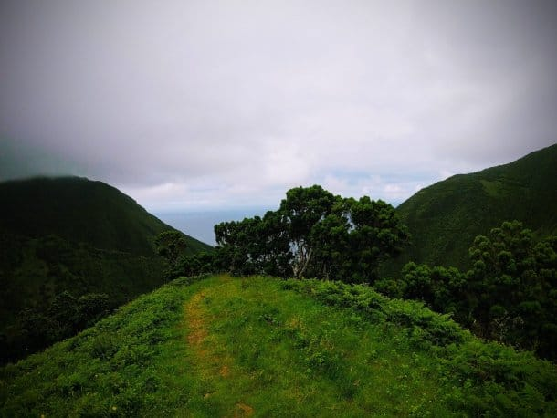
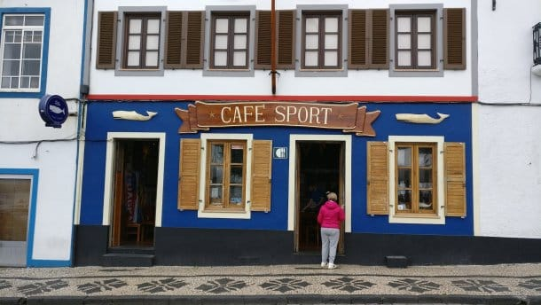

Very often, many authors use their first blog post to introduce themselves, the purpose of their words, the reason why one starts to write something new. Sometimes, the reason just urges and grows from the bottom of your deepest desires.

My introduction is simple: some years ago I owned a personal website on lightningspirit.net domain, filled up with some crazy techie stuff. Actually, I also used to write things about my daily activities, coding, web development, music, etc, and, when I remember those days, I recall how enjoyable it was to write something and get it published right away on the same day.

On the other hand, owning a blog is like having your very own virtual space, a unique piece of your fine art and your thoughts. There's no "buzzing", no "home feed", no "profile page", nothing that would make it spoil your words with fragments of existentialism.

I believe this is the best reason I rebuilt this blog.

Now, a little bit of me: Hi! I'm **Vitor**. I'm a Software Engineer based in Lisbon, Portugal, Europe currently working for **[Talkdesk](https://www.talkdesk.com)**, maintaining and dealing with daily activities regarding billing and internal tools.

In the past, I have worked for **[Sapo](http://www.sapo.pt)** (Portugal Telecom branch for web-related stuff) and contributed for WordPress.

Nowadays, I'm very focusing in learning more and more about concurrency models and application performance. I also have a strong appeal for web UI and UX.

My biggest hobby is music. I'm a creationist, author and also had a couple of projects in the past. Currently, I'm more of a solo practitioner and I share a special duet with my significant other.

I also own a personal home-made middle-range recording studio for my projects. I can share pictures later.

This summer we spent over 2 weeks in some Azores Islands, in the middle of Atlantic Ocean.

_Terrific_ is the word to describe this experience. A naturally harvested paradise, an archipelago of 8 islands mixing naturally crafted landscapes where one can hike towards small villages 30 minutes away from central towns.

One of the most convincing islands is _Sao Jorge_. Its natural beauty with such fantastic landscapes and almost all seasons happening during the same day makes it one of my favorite, I must say!

<iframe width="560" height="315" src="https://www.youtube.com/embed/Yy4-lEeNX-o" frameborder="0" allow="accelerometer; autoplay; encrypted-media; gyroscope; picture-in-picture" allowfullscreen></iframe>

As an example of that beautiful landscape, _São Jorge_ island is where you can find paths to small villages in the middle of nowhere. Villages like _Fajã de Santo Cristo_ or _Fajã do Cumbre_ are of such beauty that made me feel very connected to nature.

Azores was [allegedly first discovered by Diogo de Silves](https://en.wikipedia.org/wiki/History_of_the_Azores) in 1415. He was the one who found the most eastern cluster (_Santa Maria_ and _Sao Miguel_ islands). As the time pass, some other discoveries of other islands took place during that century as well as some disputes regarding the newly discovered islands.

<iframe width="560" height="315" src="https://www.youtube.com/embed/WBhPF8_qaYc" frameborder="0" allow="accelerometer; autoplay; encrypted-media; gyroscope; picture-in-picture" allowfullscreen></iframe>

The last one, in the Azores, took place in 1957 when in _Faial_ island a massive volcano, the [Capelinhos](https://en.wikipedia.org/wiki/Capelinhos) volcano, eruption occurred originating a new small island that was claimed by a French geologist who was close enough to be the first man stepping into the newly created island. In fact, it doesn't go well for them, since after one year, in 1958, the small island isthmus became an integral part of the island of _Faial_, giving Portugal the rights to claim it first.

_Faial_ Island is where most of the trans-atlantic ships take a rest and drink some _Gin do Mare_ at _Peter's Café Sport_. It's very well known at the space. This is the spot where sailors stop by for a couple of days enjoying their meals. It's been around there serving transients for the past two centuries.

Like all other islands, Faial also holds a very volatile weather.

There's also [_Pico_ island](https://en.wikipedia.org/wiki/Mount_Pico), holding the tallest mountain of Portugal, where one can climb it in 5 hours, walking through dangerous trails. If you're willing to give it a try, make sure that you start at the beginning of the afternoon or, as an alternative, on the very morning before the sunrise.

You're given a permission to stay for 24h in the natural park, so, if you want, you can camping in the pit crater rim of _Pico Alto_, in the mountain, and see the fantastic night sky full of starts. Otherwise, you can start climbing before the sunrise and try to climb to the very top pinnacle _Piquinho_.

If you want to rest a bit, make sure you visit and stay at [Lajes do Pico](https://en.wikipedia.org/wiki/Lajes_do_Pico) town. It's a small and very traditional village. I found people there very rustic and interesting.

Overall, the Azores experience is one of the greatest. You feel connected to nature, very close (30 min, tops) to the biggest towns. The local people are very amazing and always willing to help you everywhere, very pleasant. The local food is great, and the landscapes, superb!

If you're interested in visit Azores, go to [Visit Azores](https://www.visitazores.com/en). There's a lot of information you can use to help in your trip.

Just to let you know, at the time of this writing, this blog is running [100 out of 100 in Google Page Speed Insights](https://developers.google.com/speed/pagespeed/insights/?url=https%3A%2F%2Flightningspir.it%2F)! 💪 I'll share a post regarding how do I achieved this ranking in the near future 🙂
